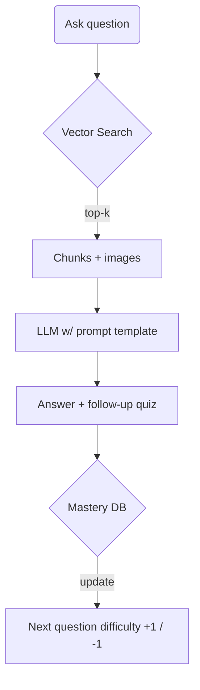

Alright, let’s blueprint the whole thing —from raw PDFs all the way to a slick, interactive “teach-me-Union-Find” web app. I’ll keep the vibe conversational, but each layer is battle-tested-real so you can scope effort and avoid rabbit holes.

---

## 0. 50-Second “Movie Trailer”

1. **Ingest** → carve the PDFs into tagged, searchable, *visual-aware* chunks (text + cropped images).
2. **Knowledge Graph** → map every chunk to a topic, difficulty, and asset type.
3. **Store** → embeddings in a vector DB, rich metadata in Postgres, page images in Google Storage.
4. **Serve** → a GraphQL / REST API that hands the front-end exactly what it needs (definitions, GIFs, exam screenshots, etc.).
5. **Front-end** → React + Tailwind app with three tabs:

   * *Concept Explorer* (animations & explanations)
   * *Playground* (Pyodide-powered code runner + tree visualizer)
   * *Practice* (exam/discussion problems with inline solutions)
6. **Tutor Bot** → RAG pipeline that pulls from the graph, chats, sets quizzes, adapts to mastery.

---

## 1. Ingestion Pipeline (aka “turning messy PDFs into gold”)

| Stage                   | Purpose                                                      | Key Tools                                                                | Gotchas                                                        | Effort             |
| ----------------------- | ------------------------------------------------------------ | ------------------------------------------------------------------------ | -------------------------------------------------------------- | ------------------ |
| **PDF → Images & Text** | Split pages, OCR equations/handwriting, capture SVGs.        | `pdfplumber`, `poppler`, `tesseract`, `Mathpix` (if lots of math).       | Quality of scanned midterms.                                   | 1–2 weeks for PoC. |
| **Chunking**            | Break into \~150–300 word or single-figure units.            | Heuristic: header detection + slide titles.                              | Prevent splitting definition mid-sentence.                     | 2–3 days tweaking. |
| **Auto-Tagging**        | Topic, subtopic, difficulty.                                 | OpenAI function-calling or spaCy keyword rules seeded from the syllabus. | Needs manual spot-check.                                       | 1 week.            |
| **Asset Cropping**      | Crop a problem image + captions, save as PNG.                | `pdf2image` + bounding-box heuristics.                                   | Equations can get chopped; quick manual override UI saves you. | 3–5 days.          |
| **Embedding & Storage** | Text ⟶ Ada v3 vector; store (`id`, `embedding`, `metadata`). | Chroma / Pinecone.                                                       | Keep embeddings <8 k tokens; chunk size matters.               | Continuous.        |

**Tip:** Build ingestion as an idempotent Airflow (or Prefect) DAG so new PDFs drop in and re-index automatically.

---

## 2. Knowledge Graph & Datastores

```
             +-------------+
 PDFs  --->  | Ingestion   |---->  Google Storage  (page images)
             +-------------+---->  Postgres (metadata)
                                \ Vector DB (embeddings)
                                 \ Neo4j optional (topic graph)
```

* **Postgres tables**

  * `chunks(id, text, topic, difficulty, pdf_id, page, bbox, has_image)`
  * `topics(id, name, parent_topic)`
  * `questions(id, chunk_id, answer_chunk_id, tags[])`

* **Vector DB**: cosine search returns a `chunk_id`; Postgres joins pull rich fields + Google Storage URL for images.

---

## 3. Serving Layer (Backend API)

* **FastAPI** for plain endpoints + async SSE (server-sent events) for live tutor chat.
* **GraphQL** if you want the front-end to request “give me definition + easy example + one medium problem.”
* Auth: just GitHub OAuth or Berkeley SSO for now.

---

## 4. Front-End Experience (React + Tailwind + d3 + Pyodide)

| Tab                  | UX Highlights                                                                                                                                                                              | Libraries                    |
| -------------------- | ------------------------------------------------------------------------------------------------------------------------------------------------------------------------------------------ | ---------------------------- |
| **Concept Explorer** | Timeline slider: *array view* + *tree view* that updates as you step through union / find.(Think Vis.js + framer-motion.)                                                                  | d3-tree, framer-motion       |
| **Playground**       | Side-by-side code editor (Monaco) + canvas that animates every operation from the user’s Python code (executed in-browser via Pyodide). Test cases run instantly; green/red badge appears. | Pyodide, pytest-mini, Monaco |
| **Practice**         | Problem card shows the exact midterm screenshot; reveal-on-click explanation + solution image. Quick emoji rating feeds mastery model.                                                     | React Query, lightbox        |

**Not overwhelming, because:**

1. Hamburger menu collapses the extra tabs.
2. Each view has a “focus mode” (just tree + code or just problem).
3. Color palette: calm Berkeley blues/golds, generous white space.

---

## 5. Adaptive Tutor Flow



* **Prompt template** injects:

  * 🏷 definitions (difficulty ≤ medium)
  * 🖼 one illustrative figure (Google Storage link → rendered as )
  * 📝 one practice Q/A (difficulty ≈ student level)

* **Mastery DB**: simple `(user_id, topic_id, EF_score, last_seen)` à la SuperMemo 2. Spaced-repetition cron job pings them on Slack/email.

---

## 6. Roadmap & Effort (MVP → Wow)

| Phase                | Scope                                                                      | Time       | You’ll Demo                                                         |
| -------------------- | -------------------------------------------------------------------------- | ---------- | ------------------------------------------------------------------- |
| **0. Spike (solo)**  | Hard-code one PDF page; parse, embed, search, answer via chat.             | 1 week     | query → “What’s path compression?” response cites lecture note crop |
| **1. MVP**           | Full ingestion of disjoint-set PDFs, Concept Explorer tab, basic RAG chat. | +3–4 weeks | Student can watch tree flatten + ask follow-ups                     |
| **2. Playground**    | Pyodide runner + d3 tree viz + 5 autograded tests.                         | +2 weeks   | Runs `union(2, 3)` live                                             |
| **3. Practice Bank** | Midterm & discussion gallery, mastery tracking, spaced review.             | +3 weeks   | Dashboard shows “85 % mastery on WQU”                               |
| **4. Scale**         | Add other data-structure topics, multiplayer study mode, AI code tutor.    | ongoing    | 🚀                                                                  |

**Team size assumption:** 1–2 devs ≈ these timelines; double the team and parallelize ingestion vs front-end.

---

## 7. Technical & Human Pitfalls

| Risk                                            | Mitigation                                                                                 |
| ----------------------------------------------- | ------------------------------------------------------------------------------------------ |
| OCR errors on math symbols → wrong explanations | Upload vector PDFs when possible; keep fallback “view original page” button.               |
| Tagging noise                                   | Manual review UI (Supabase Studio or Retool) for TA graders to approve tags quickly.       |
| Student overload                                | Default homepage = Concept Explorer; hide Practice & Playground behind “I’m ready to try.” |
| Server cost (vector DB)                         | Start with SQLite + local Faiss; swap to managed Pinecone only at >10 k chunks.            |
| LLM latency                                     | Cache frequently asked Q/A pairs, stream tokens to feel faster.                            |

---

## 8. Stretch-Goal Candy

* **“Explain my code”**: student pastes buggy Union-Find; agent annotates each line and makes a GIF of its tree evolution.
* **Voice-over mode**: agent narrates operations while tree animates (Web Speech API).
* **Competitive Playlist**: timed mini-exams drawn from past midterms; leaderboards with classmates.
* **VS Code Extension**: same playground but inside the editor.

---

### TL;DR

1. **Automate the boring PDF → chunk/tag/embed job** once; the rest is just data.
2. **Vector-backed RAG** grounds the chat.
3. **React + Pyodide** gives you that “run code, see tree squish” delight.
4. Roll out in phases so users get value as early as possible without drowning in features.

You’ll end up with a site that lets a panicked student at 2 AM *see* the array, *watch* the tree compress, *edit* code, and *practice* real Berkeley midterm questions — all powered by your original course materials. 🎬
